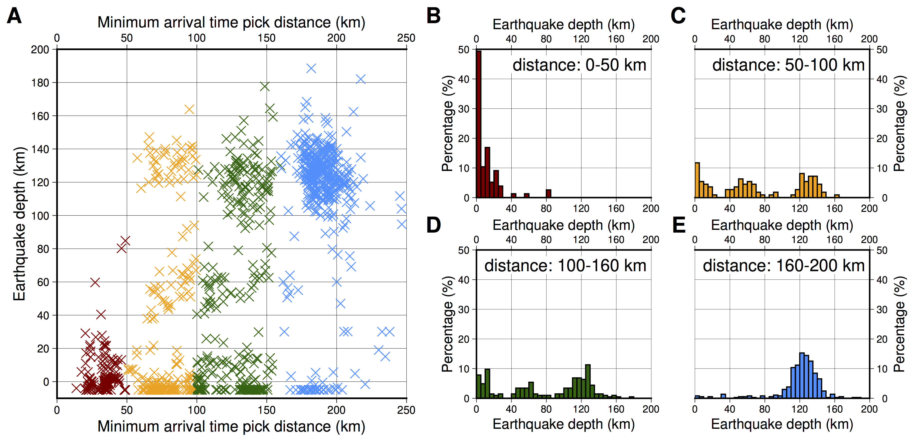
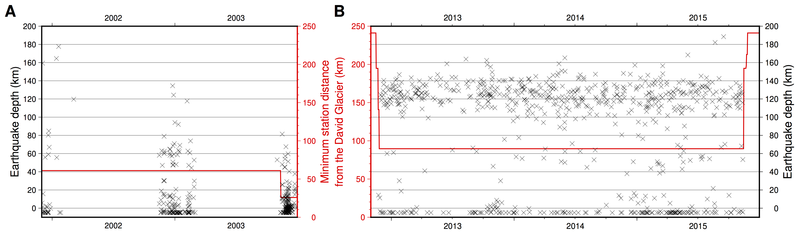
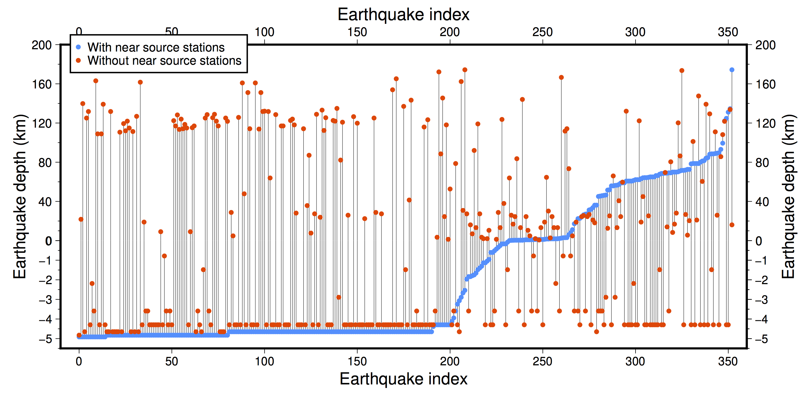
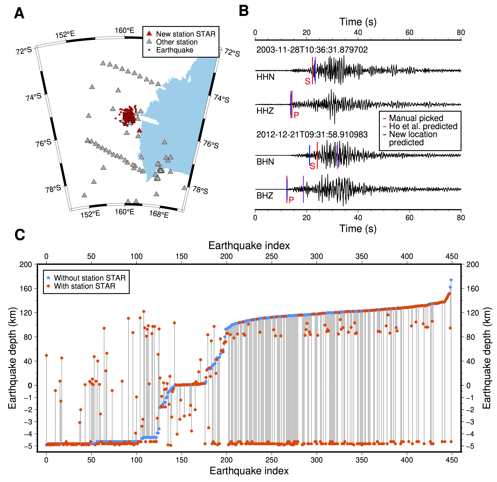

# Response to “Upper-mantle earthquakes beneath East Antarctica”

### XiaoZhuo Wei
### Department of Earth and Planetary Sciences, Jackson School of Geosciences, University of Texas at Austin, Austin, TX 78712, USA
### Email: xiaozhuo.wei@jsg.utexas.edu

Ho et al. (1) used a machine learning picker to build a new earthquake catalog in East Antarctica and detected a substantial number of intermediate-depth earthquakes (IDEs) beneath the David Glacier (48% of the total 1068 earthquakes). They used the probability density functions from the earthquake location package NonLinLoc to assess their location errors and concluded that the IDE depths are reliable, with uncertainties of less than 20 km. However, after examining their catalog, I found that the occurrence of IDEs shows an correlation with the distance to the nearest seismic station. The occurrence of IDEs is also highly temporally variable. I also reanalyzed their catalog by removing the arrival time picks within a 100 km range of the epicenter and found drastic changes in the earthquake depths. Finally, I manually picked the phase arrivals from a new station STAR relatively close to the David Glacier, which belongs to the Polar Seismic Italian Network (network code: DY) and was not used by their study. The addition of the new phase picks once again caused a large number of the IDEs to be located as shallow earthquakes. All the above results indicate the earthquake depth errors are significantly underestimated in Ho et al. and the IDEs are very likely to be icequakes that occurred within or at the base of the David Glacier (2–4), but mislocated to much deeper depths.

The most straightforward way to determine earthquake locations is through their P- and S-wave arrival times. However, given the uncertainties in seismic wave phase picking and arrival time calculation due to three-dimensional structures, earthquake depths are better constrained by nearby stations rather than by stations hundreds of kilometers away. This is because at greater distances, seismic waves spend more time traveling horizontally than vertically. When I plotted the earthquake depths in Ho et al. against their distance to the closest seismic station whose arrival times were used for earthquake location (Figure 1A), I found that the earthquakes are mostly shallow when they are located with a nearby (<50 km) seismic station (Figure 1B). IDEs become increasingly dominant as the epicentral distance increases (Figure 1C-1E). Also, when I plotted the earthquake depths with respect to occurrence time, I found that IDEs occurred rarely during 2001-2003 (Figure 2A) but mainly during 2013-2015 (Figure 2B). Stations were much closer to the David Glacier during 2001-2003 than during 2013-2015.

The above two strong correlations between the earthquake depth and the seismic station distance strongly suggest that the source depths may not be well constrained.

To test the importance of the near source arrival time picks, I designed the following experiment: I found a total of 353 earthquakes in Ho et al. that had at least one arrival time picked within a 100 km range. I was able to reproduce their depth distribution using the provided arrival time dataset and velocity structure (1). I removed all the time picks within a 100 km range and performed the earthquakes location again. I found a substantial number (42%) of the shallow (<20 km) earthquakes were located as IDEs and a substantial number (43%) of the IDEs were located as shallow earthquakes (Figure 3). This experiment suggests that Ho et al. considerably underestimated the source depth uncertainties of the IDEs, and the high occurrence rate of IDEs during 2013-2015 may primarily reflect the lack of near source arrival time picks.

Finally, I discovered that the station STAR of the Polar Seismic Italian Network had continuous recordings during the study period of Ho et al. but was not used in their study. More importantly, the station was closer to the David Glacier than all other stations during 2012-2015 (∼75 km vs ∼90 km; Figure 4A). I manually picked the P- and S-wave arrival times on waveforms with good signal-to-noise ratios (Figure 4B). I performed the location for a total of 450 earthquakes with the new arrival time data, including 252 IDEs. The results show clearly that a large portion of IDEs (49%) were located as shallow earthquakes (Figure 4C). This once again supports our previous hypothesis that the IDEs reported by Ho et al. may primarily result from location errors caused by the lack of near source arrival time measurements.

It is also worth noting that when Ho et al. used the equal differential-time likelihood function for the earthquake location, the NonLinLoc package (5) would down-weight arrival times with large misfits. There were 17 earthquakes in Ho et al., all of which were IDEs and actually had phase picks within 100 km but were discarded due to their large misfits. A similar issue also occurred in the station STAR dataset. The majority (55%) of the 70 IDEs that remained as IDEs (Figure 4C) were due to the arrival times of station STAR being considerably down-weighted because of their large misfits. This highlights the additional complexity of earthquake location: even when near source stations are available, earthquake depths can still be inaccurate.

Based on all the above analyses, I do not think that Ho et al. provided sufficient evidence that IDEs occurred beneath the David Glacier. I suspect that their reported IDEs are icequakes that occurred near the surface but were mislocated at much greater depths.

 

**Funding:** XZ. W. is supported by the EPS Excellence Postdoctoral Fellowship, at the Department of Earth and Planetary Sciences, Jackson School of Geosciences, University of Texas at Austin.

**Data, code and materials availability:** The seismic data used in this study are publicly available from European Integrated Data Archive (https://eida.ingv.it/en/getdata), under the network code DY.

 

   

**Figure 1: Earthquake depth distribution with respect to minimum arrival time pick distance range.** (A) The earthquake depths plotted against their minimum arrival time pick distances. (B) The earthquake depth distribution where the minimum arrival time pick distance is between 0 and 50 km. (C) The same as panel (B), but the minimum arrival time pick distance is between 50 and 100 km. (D) The same as panel (B), but the minimum arrival time pick distance is between 100 and 160 km. (E) The same as panel (B), but the minimum arrival time pick distance is between 160 and 200 km.

 

   

**Figure 2: Temporal distribution of earthquake depths with respect to minimum station distance from the David Glacier.** (A) During 2001-2003. (B) During 2012-2015.

 

   

**Figure 3: Earthquake depths located with and without the near source stations.** The near source stations are defined as stations within 100 km of the earthquakes.

 

   

**Figure 4: Location and waveforms of station STAR, and earthquake depths located with and without the station.** (A) The location of the new station STAR with respect to the earthquake locations reported by Ho et al. and the seismic stations used in their study. (B) The waveforms of a shallow earthquake and a IDE reported by Ho et al. recorded on the new station STAR, filtered between 1 and 10 Hz, along with the manually picked P- and S-wave arrival times. The predicted arrival times from the locations in Ho et al. and in this study are also plotted. (C) The earthquake depths with and without the new station STAR.

  

**References:**
1. L. M. Ho, J. L. Sánchez-Roldán, S. E. Hansen, J. I. Walter, Upper-mantle earthquakes beneath East Antarctica. Science 392 (6801), 942–945 (2026).
2. S. Danesi, S. Bannister, A. Morelli, Repeating earthquakes from rupture of an asperity under an Antarctic outlet glacier. Earth and Planetary Science Letters 253 (1-2), 151–158 (2007).
3. L.K.Zoet, S. Anandakrishnan, R. B. Alley, A. A. Nyblade, D. A. Wiens, Motion of an Antarctic glacier by repeated tidally modulated earthquakes. Nature Geoscience 5 (9), 623–626 (2012).
4. S. Danesi, et al., Ice mass discharge through the Antarctic subglacial hydrographic network as a trigger for cryoseismicity. Journal of Glaciology 71, e89 (2025).
5. A. Lomax, J. Virieux, P. Volant, C. Berge-Thierry, Probabilistic earthquake location in 3D and layered models: Introduction of a Metropolis-Gibbs method and comparison with linear locations, in Advances in seismic event location (Springer), pp. 101–134 (2000).
